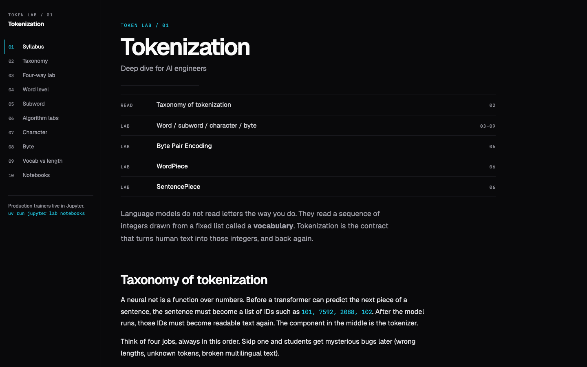
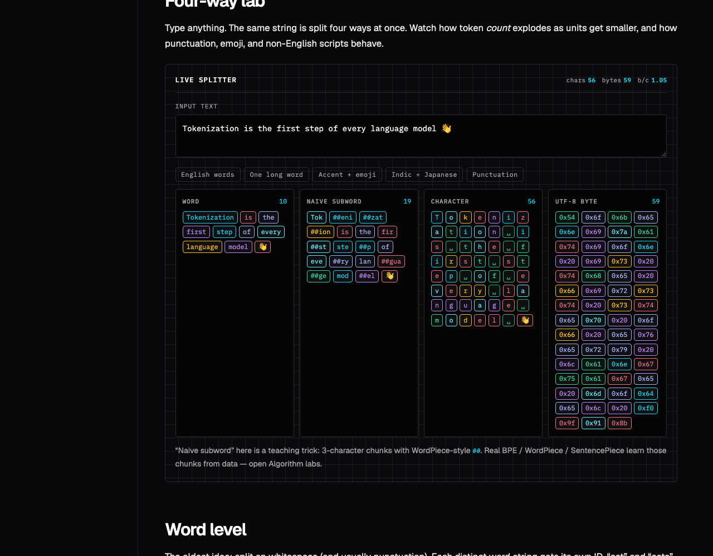
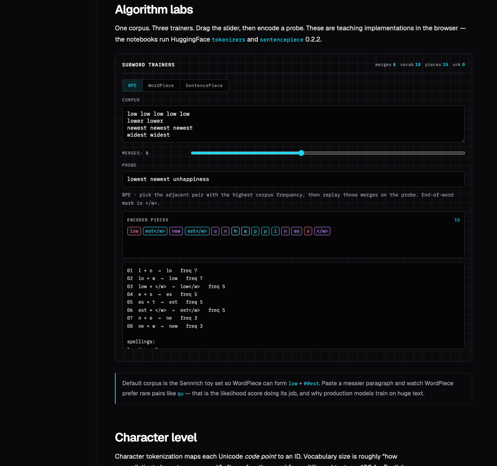

# Tokenization Deep Dive

[](https://sourangshupal.github.io/tokenization-explainer/)
[](https://github.com/sourangshupal/tokenization-explainer/actions/workflows/pages.yml)
[](https://www.python.org/downloads/)
[](https://docs.astral.sh/uv/)
[](https://github.com/huggingface/tokenizers)
[](https://github.com/google/sentencepiece)
[](LICENSE)

Interactive course for AI engineers: a static **token lab** in the browser, then three Jupyter notebooks that train BPE, WordPiece, and SentencePiece from scratch before using current PyPI libraries via **uv**.

**[Open the live site](https://sourangshupal.github.io/tokenization-explainer/)** — no install. All playgrounds run in your browser.

Deep links for class chat:

- [BPE lab](https://sourangshupal.github.io/tokenization-explainer/?tab=bpe#algo-labs)
- [WordPiece lab](https://sourangshupal.github.io/tokenization-explainer/?tab=wordpiece#algo-labs)
- [SentencePiece lab](https://sourangshupal.github.io/tokenization-explainer/?tab=sentencepiece&sp=unigram#algo-labs)

<p align="center">
  
</p>

## What you get

| Surface | Runs where | What students do |
|---|---|---|
| [Live site](https://sourangshupal.github.io/tokenization-explainer/) | GitHub Pages (static HTML/JS) | Taxonomy, four-way splitter, OOV trap, UTF-8 inspector, in-browser BPE / WordPiece / SentencePiece, compare row, predict-then-reveal |
| Jupyter notebooks | Local Python 3.12 + uv | Same algorithms from scratch, then HuggingFace `tokenizers` 0.23.1, `sentencepiece` 0.2.2, `tiktoken` 0.14.0 |

The website does **not** need Python. Notebooks do **not** run on GitHub Pages.

Instructors: see [`INSTRUCTOR.md`](INSTRUCTOR.md) for the 90-minute script and golden answers.

## Syllabus

1. Taxonomy of tokenization
2. Word / subword / character / byte level (live labs)
3. Byte Pair Encoding — site lab + `notebooks/01_bpe.ipynb`
4. WordPiece — site lab + `notebooks/02_wordpiece.ipynb`
5. SentencePiece — site lab + `notebooks/03_sentencepiece.ipynb`

## Two corpora (important)

| File | Used by |
|---|---|
| [`data/sennrich_toy.txt`](data/sennrich_toy.txt) | Website **Sennrich toy** preset; from-scratch BPE / WordPiece in notebooks |
| [`data/tiny_corpus.txt`](data/tiny_corpus.txt) | Website **Course corpus** preset; HuggingFace / SentencePiece training cells |

Same probe (`lowest`) can produce different merges across the two files. That is expected.

## Live playgrounds

Four-way split of the same string (word, naive subword, character, UTF-8 bytes):

<p align="center">
  
</p>

Same corpus, three trainers. Switch **BPE**, **WordPiece**, and **SentencePiece** without leaving the page:

<p align="center">
  
</p>

| Lab | What it teaches |
|---|---|
| Four-way splitter | How token *count* explodes as units get smaller |
| OOV trap | Word-level `[UNK]` when a type was never in the vocab (predict, then reveal) |
| UTF-8 inspector | Graphemes vs code points vs bytes (emoji, Indic, Japanese) |
| Length bars | Vocab size vs sequence length (**naive 3-char is labeled — not BPE**) |
| BPE tab | Max pair frequency, `</w>` end-of-word mark, round-trip decode |
| WordPiece tab | Score `freq(ab)/(freq(a)·freq(b))`, greedy `##` encode |
| SentencePiece tab | Unigram Viterbi with `▁`, or BPE with no whitespace split |
| Compare row | Same probe under all three algorithms at once |

Default teaching corpus is the Sennrich toy set. WordPiece on that set encodes `lowest` as `low` + `##est`.

Projector tip: use the **Light** theme toggle in the nav.

## Teaching diagrams

Full-page SVG schematics (Token Lab cyan on light paper) — better for projectors than mermaid fences:

| Diagram | URL |
|---|---|
| Gallery | https://sourangshupal.github.io/tokenization-explainer/diagrams/ |
| Tokenizer pipeline | [01-pipeline.html](https://sourangshupal.github.io/tokenization-explainer/diagrams/01-pipeline.html) |
| Granularity layers | [02-granularity.html](https://sourangshupal.github.io/tokenization-explainer/diagrams/02-granularity.html) |
| BPE train loop | [03-bpe-train.html](https://sourangshupal.github.io/tokenization-explainer/diagrams/03-bpe-train.html) |
| BPE vs WordPiece | [04-bpe-vs-wordpiece.html](https://sourangshupal.github.io/tokenization-explainer/diagrams/04-bpe-vs-wordpiece.html) |
| Detokenize marks | [05-detokenize-marks.html](https://sourangshupal.github.io/tokenization-explainer/diagrams/05-detokenize-marks.html) |

Local path: `site/diagrams/`.

## Quickstart (notebooks)

Requires [uv](https://docs.astral.sh/uv/) and Python 3.12+. Do not use pip.

```bash
git clone https://github.com/sourangshupal/tokenization-explainer.git
cd tokenization-explainer
uv sync
uv run jupyter lab notebooks
```

Work through the notebooks in order:

| Notebook | Topic |
|---|---|
| [`notebooks/01_bpe.ipynb`](notebooks/01_bpe.ipynb) | Frequency BPE from scratch (Sennrich), HuggingFace `BpeTrainer` (course corpus), then `tiktoken` |
| [`notebooks/02_wordpiece.ipynb`](notebooks/02_wordpiece.ipynb) | Likelihood WordPiece from scratch, `##` continuation, `WordPieceTrainer` |
| [`notebooks/03_sentencepiece.ipynb`](notebooks/03_sentencepiece.ipynb) | Unigram Viterbi intuition, then `sentencepiece` 0.2.2 (`return_type=`, not deprecated `out_type`) |

Each production trainer uses [`data/tiny_corpus.txt`](data/tiny_corpus.txt). Written models go to `artifacts/` (gitignored).

**Network notes**

- First `tiktoken.get_encoding(...)` **downloads** encoding files — do that once on a network before an offline lab.
- If `sentencepiece` fails to install, load [`models/pretrained/sp_unigram_tiny.model`](models/pretrained/sp_unigram_tiny.model) and skip training (see notebook).

Local site (optional; the Pages URL is enough for class):

```bash
uv run python -m http.server 8000 --directory site
```

Then open `http://localhost:8000`. You can also open `site/index.html` directly (`file://` works).

## Regression checks

```bash
node tests/golden_algos.mjs
uv run python scripts/build_notebooks.py
```

## Project layout

```
tokenization-explainer/
├── site/                      # GitHub Pages root (static)
│   ├── index.html
│   ├── css/main.css
│   ├── assets/og.png
│   ├── diagrams/              # five teaching schematics + STYLE.md
│   └── js/                    # corpora → playgrounds → algorithms → main
├── notebooks/                 # 01 BPE, 02 WordPiece, 03 SentencePiece + lab_display.py
├── data/sennrich_toy.txt      # classic four-word set
├── data/tiny_corpus.txt       # richer course corpus
├── models/pretrained/         # fallback SentencePiece model
├── scripts/build_notebooks.py
├── tests/golden_algos.mjs
├── INSTRUCTOR.md
├── assets/readme/             # README screenshots
├── pyproject.toml
└── .github/workflows/pages.yml
```

## Libraries (pinned via uv)

Resolved from PyPI; see `uv.lock`.

| Package | Role |
|---|---|
| `tokenizers` 0.23.1 | HuggingFace BPE and WordPiece trainers |
| `sentencepiece` 0.2.2 | Google SentencePiece (pybind11 API) |
| `tiktoken` 0.14.0 | Production byte-level BPE (OpenAI models) |
| `jupyterlab` 4.6.3, `ipykernel`, `ipywidgets` | Notebooks and live widgets |
| `rich` 15.0.0 | Jupyter tables, colored token chips, Mix-cell explainer |

SentencePiece 0.2.2: use `encode(..., return_type=str)` and `SentencePieceProcessor.from_file(...)`. Do not use deprecated `out_type` or `EncodeAsImmutableProto`.

## GitHub Pages

The site is static. GitHub Actions (`.github/workflows/pages.yml`) uploads the `site/` folder on every push to `main`. No Jekyll (`.nojekyll`).

Notebooks, `uv`, and trained `.model` files under `artifacts/` are **not** part of Pages. The checked-in pretrained model under `models/pretrained/` is for local notebook fallback only.

---

## Production Tokenizer (`production` branch)

The `production` branch trains a **byte-level BPE tokenizer on legal English** and publishes it to the Hugging Face Hub as a drop-in `AutoTokenizer`.

> **Branch strategy:** `main` is the teaching course — untouched. All production work lives on `production`.

### Why legal English?

Domain-adapted BPE uses **9–17% fewer tokens** than GPT-4o/Llama-3 on legal documents (KL3M, 2025). Specialized terms like `certiorari`, `indemnification`, and `subrogation` each become **one token** instead of 3–5.

### Quickstart

```bash
git checkout production
make install          # uv sync
```

Run the full pipeline step by step:

```bash
make corpus           # stream + shard FreeLaw      (~30-45 min, I/O)
make train            # train byte-level BPE         (~1-2 h, CPU)
make wrap             # wrap into HF fast tokenizer
make eval             # TokEval metrics vs gpt2 + cl100k_base
make test             # 112 pytest cases
make push REPO=YOUR_USERNAME/legal-bpe-50k
```

Or all in one shot:

```bash
make all
```

**Override defaults on the command line:**

| Variable | Default | Example |
|---|---|---|
| `MAX_SHARDS` | 10 | `make corpus MAX_SHARDS=5` |
| `SHARD_MB` | 500 | `make corpus SHARD_MB=200` |
| `VOCAB_SIZE` | 50257 | `make train VOCAB_SIZE=100000` |
| `MIN_FREQ` | 2 | `make train MIN_FREQ=5` |
| `TEST_DOCS` | 500 | `make eval TEST_DOCS=1000` |
| `REPO` | YOUR_USERNAME/legal-bpe-50k | `make push REPO=alice/legal-bpe-50k` |

**Useful shortcuts:**

```bash
make smoke    # import check + CLI help + pytest collect (no model needed)
make clean    # delete data/corpus/ and models/legal-bpe-50k/
make help     # list all targets with descriptions
```

**Direct script equivalents (if you prefer not to use make):**

```bash
uv run python scripts/build_corpus.py --max-shards 10 --shard-size-mb 500
uv run python scripts/train_tokenizer.py
uv run python scripts/wrap_tokenizer.py
uv run python scripts/eval_tokenizer.py
uv run pytest tests/test_tokenizer.py -v
uv run python scripts/push_hub.py --repo YOUR_USERNAME/legal-bpe-50k
```

### One-liner load (after Hub push)

```python
from transformers import AutoTokenizer
tok = AutoTokenizer.from_pretrained("YOUR_USERNAME/legal-bpe-50k")
```

### Target evaluation results

| Metric | legal-bpe-50k (target) | gpt2 | cl100k_base |
|---|---|---|---|
| Vocab size | 50,257 | 50,257 | 100,277 |
| Fertility (tokens/word) on legal | < 1.8 | ~2.2 | ~1.9 |
| Domain-term single-token rate | > 40% | < 10% | < 15% |
| Round-trip pass rate | 100% | 100% | 100% |
| UNK-free on arbitrary UTF-8 | yes | no | yes |
| Renyi efficiency (a=2) | measure + report | baseline | compare |

### Scripts

| Script | Purpose |
|---|---|
| `scripts/build_corpus.py` | Stream FreeLaw from HF Hub, filter, dedup, shard to `data/corpus/` |
| `scripts/train_tokenizer.py` | ByteLevel BPE + GPT-4 regex pre-tokenizer, saves `tokenizer.json` |
| `scripts/wrap_tokenizer.py` | Wraps into `PreTrainedTokenizerFast`, calls `save_pretrained` |
| `scripts/eval_tokenizer.py` | TokEval metrics suite: fertility, Renyi, domain terms, digit alignment |
| `scripts/push_hub.py` | HF login + `push_to_hub` |
| `tests/test_tokenizer.py` | pytest suite: round-trip, UNK-free, adversarial battery (TokTier) |

### Training time

BPE training is **CPU-bound** -- GPUs sit idle during merge learning.

| Phase | Estimated time |
|---|---|
| Corpus download + sharding (10 shards) | 30-45 min |
| BPE training (Rust, all cores, 5 GB corpus) | 1-2 hours |
| Wrap + eval + push | ~15 min |

GPUs are useful for the optional downstream proxy evaluation (train a 10M-param GPT on the vocabulary and compare bits-per-byte).

### Gitignored artifacts

`data/corpus/` and `models/legal-bpe-50k/` are both `.gitignore`d -- they are large and reproducible. Only scripts and tests are committed.

## License

[MIT](LICENSE)
