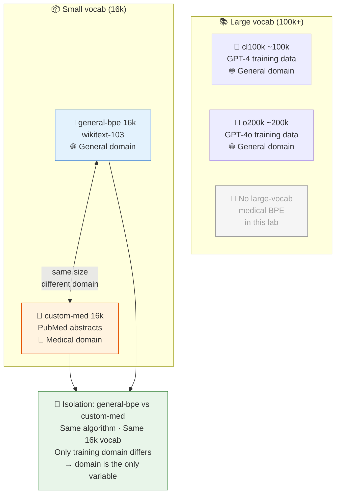
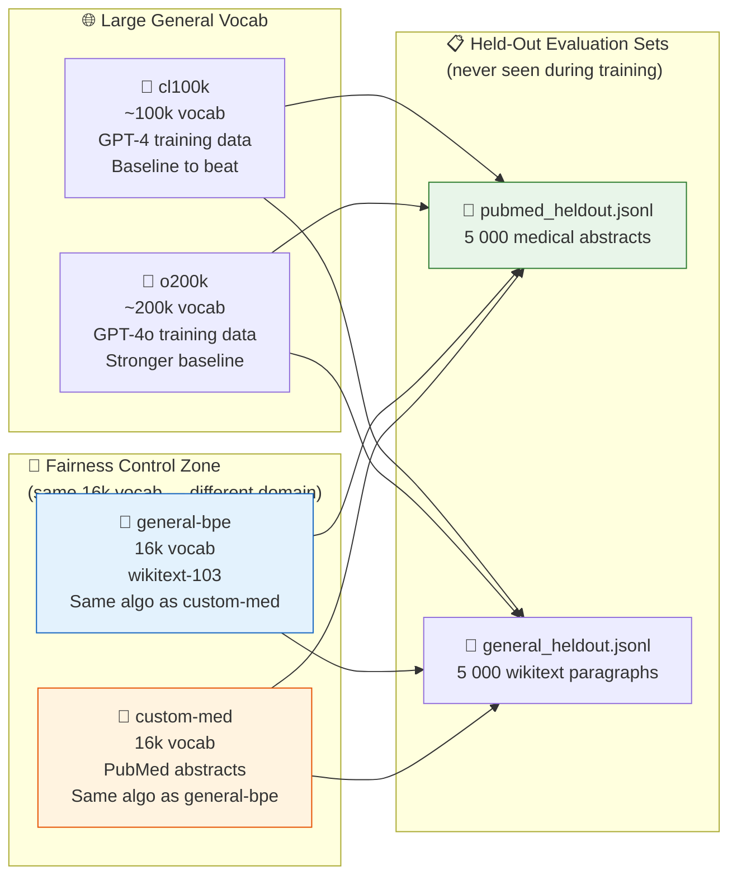
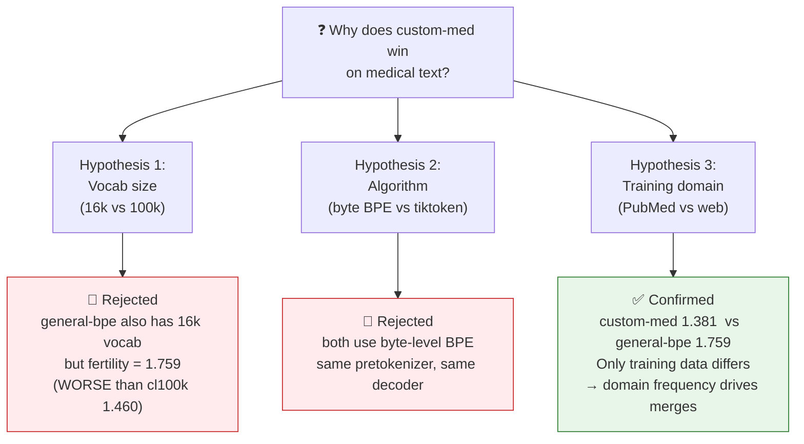

# ⚖️ The 4-Tokenizer Fairness Design

> **The problem with a naive comparison:** Comparing a 16k domain BPE against cl100k (100k vocab)
> mixes two variables — **domain** AND **vocab size**. To isolate domain as the cause, we need
> a same-size general baseline.

## The 2×2 design

## What each tokenizer proves

## The proof table — held-out fertility results

| Tokenizer | Vocab | Medical held-out fertility | General held-out fertility |
|-----------|-------|---------------------------|---------------------------|
| 🏥 **custom-med** | 16k | **1.381 ✅ wins** | 1.812 ❌ loses |
| 📰 general-bpe | 16k | 1.759 ❌ | **1.503 ✅ wins** |
| 🤖 cl100k | ~100k | 1.470 | 1.434 |
| 🤖 o200k | ~200k | 1.439 | 1.401 |

> **Reading the table:** `custom-med` (1.381) beats `general-bpe` (1.759) by **0.378**
> on the same medical held-out set.  
> They have **identical algorithm** and **identical vocab size (16k)**.  
> The only variable is training domain. **Domain is the cause.**

## The isolation argument

---
*Back to theory: [04 metrics](../theory/04-metrics.md) · [05 why custom wins](../theory/05-why-custom-wins-in-healthcare.md)*
