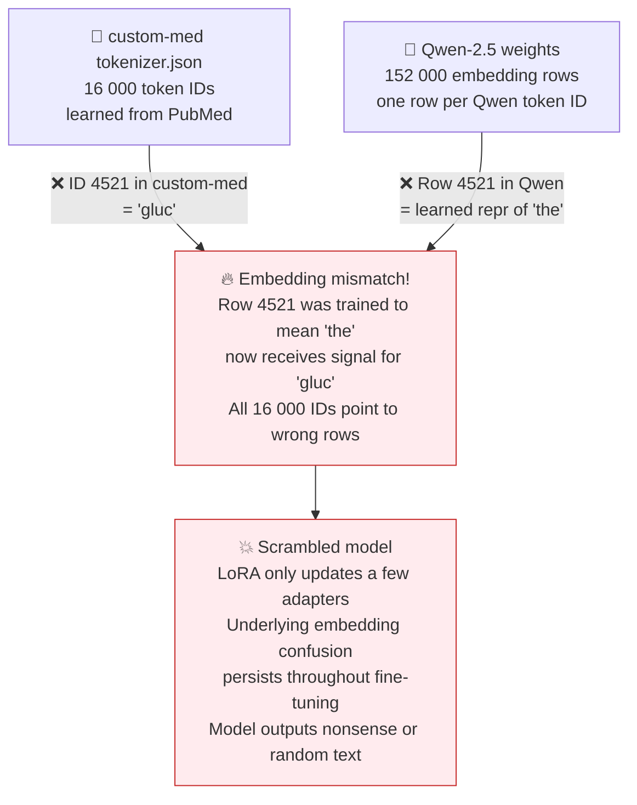
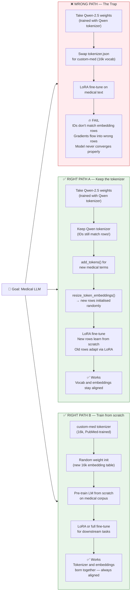
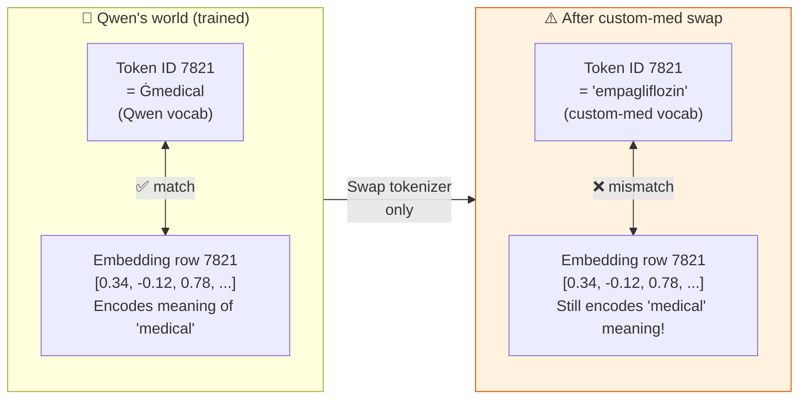
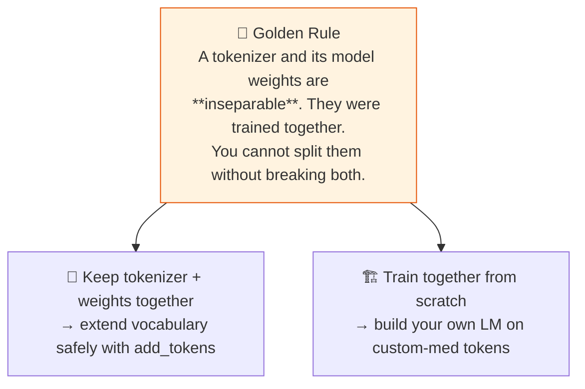

# ⚠️ The Pretrained-Model Trap

> **"I'll just swap in my custom tokenizer on Qwen/LLaMA and do LoRA."**
> This sounds reasonable. It is catastrophically wrong.

## The core mismatch

## Two valid paths, one fatal path

## Why the alignment matters: a concrete example

## The golden rule

> **This lab** focuses on tokenizers, not LM training. But understanding this trap helps you see
> why the tokenizer step is not just a preprocessing detail — it **determines what model you can use**.

---
*Back to theory: [06 pretrained model trap](../theory/06-pretrained-model-trap.md)*
