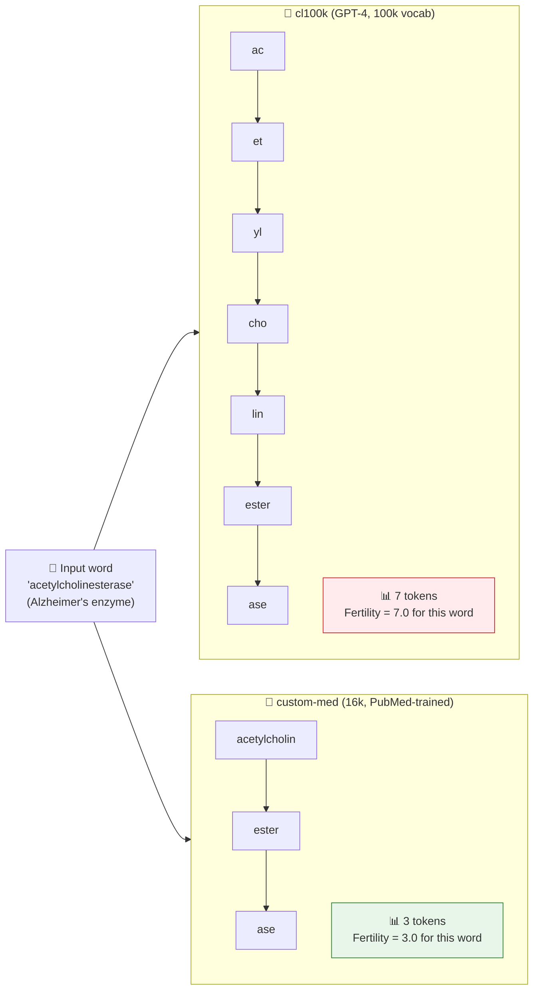
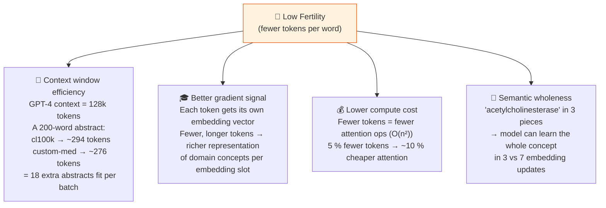
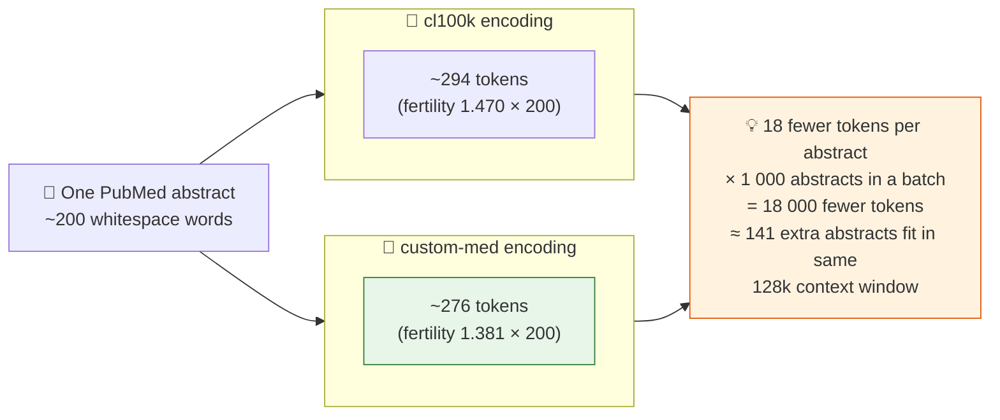

# 🌱 Fertility: Why Fewer Tokens Per Word Wins

> **Fertility** = average tokens per whitespace word.  
> Lower is better. A tokenizer that splits `acetylcholinesterase` into 2 pieces knows medicine.
> One that splits it into 8 is wasting context window and gradient signal.

## What happens to one clinical term

## Why low fertility matters

## The actual numbers from this lab

**Medical held-out set** (`pubmed_heldout.jsonl` — 5 000 abstracts, lower = better)

| Rank | Tokenizer | Fertility | Notes |
|------|-----------|-----------|-------|
| 🥇 1 | 🏥 **custom-med** (16k) | **1.381** | Domain training wins |
| 🥈 2 | 🤖 o200k (200k) | 1.439 | 12× bigger vocab, still loses |
| 🥉 3 | 🤖 cl100k (100k) | 1.470 | 6× bigger vocab, still loses |
| 4 | 📰 general-bpe (16k) | 1.759 | Same size as custom-med — domain is the secret |

> 🏆 `custom-med` wins with fertility **1.381**  
> Even `cl100k` (6× bigger vocab) loses — at **1.470**  
> `general-bpe` (same 16k size) is worst at **1.759** — vocab size isn't the secret, **domain is**

## The flip side — general text

**General held-out set** (`general_heldout.jsonl` — 5 000 wikitext paragraphs, lower = better)

| Rank | Tokenizer | Fertility | Notes |
|------|-----------|-----------|-------|
| 🥇 1 | 🤖 o200k (200k) | **1.401** | Web-scale vocab wins on web text |
| 🥈 2 | 🤖 cl100k (100k) | 1.434 | Strong general baseline |
| 🥉 3 | 📰 general-bpe (16k) | 1.503 | Small but general-trained |
| 4 | 🏥 **custom-med** (16k) | 1.812 | Specialised vocab — expected to lose here |

> 🔄 `custom-med` **loses** on general text (1.812 — worst!)  
> This is expected and healthy — it specialised its 16k budget on medical morphemes  
> A student who notices this flip has understood domain specialisation

## Fertility over a full abstract

---

## Glossary at a glance

| Term | Formula | What it tells you |
|------|---------|------------------|
| **Fertility** | tokens ÷ whitespace words | Avg pieces per word (lower = more efficient) |
| **Chars/token** | characters ÷ tokens | Avg characters per token (higher = denser) |
| **Single-token rate** | fraction of terms = 1 token | Vocab coverage of domain jargon |

---
*Back to theory: [01 why tokenization matters](../theory/01-why-tokenization-matters.md) · [04 metrics](../theory/04-metrics.md)*
